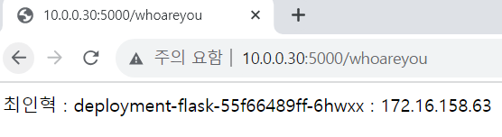
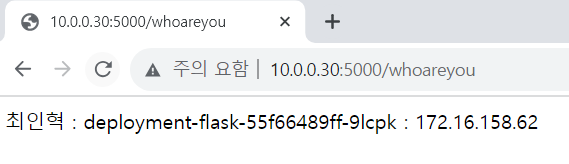

# 쿠버네티스 실습

```

아래 조건을 만족하는 플라스크 애플리케이션을 개발하고 쿠버네티스 클러스터에 배포해 보세요. 

플라스크 애플리케이션은 /whoareyou 요청에 대해 작성자 이름, 호스트 이름, IP 주소를 반환
예) 홍길동, hostname-deployment-7d4f978855-2kkw6, 10.0.0.4

플라스크 애플리케이션을 구동하는 컨테이너 이미지의 이름은 whoami-flask:v1 으로 설정해 본인의 도커 허브에 등록

디플로이먼트의 레플리카는 5개로 설정해서 배포하고, LoadBalancer 타입의 서비스를 이용해서 디플로이먼트를 연동

```


#### 1. 프로젝트 셋업

```shell
cd /kubernetes
mkdir whoami-flask
cd whoami-flask

code .
python -m venv venv
source venv/Scripts/activate
pip install flask
```


#### 2. 플라스크 애플리케이션 제작

```python
from flask import Flask
import socket 

app = Flask(__name__)
hostname = socket.gethostname()
ip_address = (socket.gethostbyname(hostname))

@app.route("/whoareyou")
def hello():
    return "최인혁 : " + hostname + " : " + ip_address


if __name__ == "__main__":
    app.run(host='0.0.0.0',port=5000)
```
- host='0.0.0.0' = 모든 호스트로 접속 가능하게 함


#### 3. test

```python
python app.py
```


#### 4. requirements.txt 파일 생성
```python
python freeze > requirements.txt
```


#### 5. Dockerfile 작성

C:\kubernetes\whoami-flask\Dockerfile

```Dockerfile
FROM python
WORKDIR /myapp
COPY . .
RUN pip3 install -r requirements.txt
CMD ["python", "/myapp/app.py"]
```

#### 6. Docker image 빌드

```shell
docker image build -t cinhyeok/whoami-flask:v1 .
```

```shell
C:\kubernetes\whoami-flask>docker image ls
REPOSITORY              TAG       IMAGE ID       CREATED              SIZE
cinhyeok/whoami-flask   v1        0574cd286813   About a minute ago   1.05GB
```

#### 7. container 실행 및 테스트

```shell
C:\kubernetes\whoami-flask>docker container run --rm -p 5000:5000 cinhyeok/whoami-flask:v1
 * Serving Flask app 'app'
 * Debug mode: off
WARNING: This is a development server. Do not use it in a production deployment. Use a production WSGI server instead.
 * Running on all addresses (0.0.0.0)
 * Running on http://127.0.0.1:5000
 * Running on http://172.17.0.2:5000
Press CTRL+C to quit
172.17.0.1 - - [12/Oct/2023 09:30:10] "GET / HTTP/1.1" 404 -
172.17.0.1 - - [12/Oct/2023 09:30:12] "GET /whoareyou HTTP/1.1" 200 -
```


#### 8. Docker image 등록

```shell
C:\kubernetes\whoami-flask>docker image push cinhyeok/whoami-flask:v1
```


#### 9. Deployment와 Service manifast 파일 작성

*** metallb 설치 필수 - EXTERNAL_IP를 생성하여 외부에서 접속가능하게 함

```yaml
apiVersion: apps/v1
kind: Deployment
metadata:
  name: deployment-flask
spec:
  replicas: 5
  selector:
    matchLebels:
      app: my-flask
  template:
    metadata:
      name: my-flask-pod
      labels:
        app: my-flask
    spec:
      containers:
      - name: my-flask-container
        image: docker.io/cinhyeok/whoami-flask:v1
        port:
        - containerPort: 5000
      imagePullSecrets:
      - name: regcred
---
apiVersion: v1
kind: Service
metadata:
  name: service-flask
spec:
  type: LoadBalancer
  ports:
  - name: my-flask
    port: 5000
    targetPort: 5000
  selector:
    app: my-flask
```

#### 10. Deployment와 Service 생성

```shell
vagrant@master-node:~$ kubectl apply -f whoami-flask.yaml << 생성
deployment.apps/deployment-flask created
service/service-flask created

vagrant@master-node:~$ kubectl get pod,deployment,service << 생성 확인
NAME                                    READY   STATUS    RESTARTS   AGE
pod/deployment-flask-55f66489ff-6hwxx   1/1     Running   0          56s
pod/deployment-flask-55f66489ff-9lcpk   1/1     Running   0          56s
pod/deployment-flask-55f66489ff-kcpkx   1/1     Running   0          56s
pod/deployment-flask-55f66489ff-njjpc   1/1     Running   0          56s
pod/deployment-flask-55f66489ff-p6kzr   1/1     Running   0          56s

NAME                               READY   UP-TO-DATE   AVAILABLE   AGE
deployment.apps/deployment-flask   5/5     5            5           56s

NAME                    TYPE           CLUSTER-IP      EXTERNAL-IP   PORT(S)          AGE
service/kubernetes      ClusterIP      172.17.0.1      <none>        443/TCP          6d10h
service/service-flask   LoadBalancer   172.17.43.127   10.0.0.30     5000:32430/TCP   56s
```

#### 11. 로드밸런서 IP로 접근했을 때 다섯 개의 파드로 요청이 분배되는 것을 확인

```shell
vagrant@master-node:~$ kubectl get pod
NAME                                READY   STATUS    RESTARTS   AGE
deployment-flask-55f66489ff-6hwxx   1/1     Running   0          2m5s
deployment-flask-55f66489ff-9lcpk   1/1     Running   0          2m5s
deployment-flask-55f66489ff-kcpkx   1/1     Running   0          2m5s
deployment-flask-55f66489ff-njjpc   1/1     Running   0          2m5s
deployment-flask-55f66489ff-p6kzr   1/1     Running   0          2m5s
```

```shell
vagrant@master-node:~$ wget -q -O - http://10.0.0.30:5000/whoareyou
최인혁 : deployment-flask-55f66489ff-6hwxx : 172.16.158.63

vagrant@master-node:~$ wget -q -O - http://10.0.0.30:5000/whoareyou
최인혁 : deployment-flask-55f66489ff-9lcpk : 172.16.158.62

vagrant@master-node:~$ wget -q -O - http://10.0.0.30:5000/whoareyou
최인혁 : deployment-flask-55f66489ff-p6kzr : 172.16.87.234

vagrant@master-node:~$ wget -q -O - http://10.0.0.30:5000/whoareyou
최인혁 : deployment-flask-55f66489ff-kcpkx : 172.16.87.233

vagrant@master-node:~$ wget -q -O - http://10.0.0.30:5000/whoareyou
최인혁 : deployment-flask-55f66489ff-njjpc : 172.16.158.2
```







